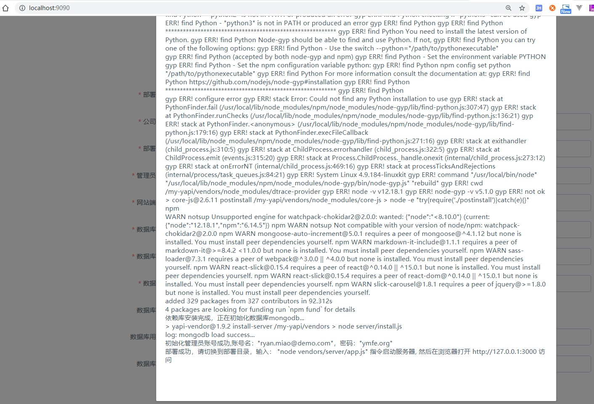

YApi Docker镜像
==============


Base:https://github.com/YMFE/yapi/releases

制作本地的yapi docker镜像, docker-compose一键维护和部署.

## How

1. 初始化db, 开启自定义配置

```
git clone https://github.com/Ryan-Miao/docker-yapi.git
cd docker-yapi
docker-compose up
```

打开 localhost:9090

点击开始部署.

1. 打开数据库认证
2. 填写数据库用户名"yapi"
3. 填写数据库密码"yapi123456" | mongo-conf/init-mongo.js中你配置的数据库账户



2. 部署完毕后, 修改docker-compose.yml
启用

```
  yapi:
    build:
      context: ./
      dockerfile: Dockerfile
    image: yapi
    # 第一次启动使用
    # command: "yapi server"
    # 之后使用下面的命令
    command: "node /my-yapi/vendors/server/app.js"
```

重启服务:

```
docker-compose up
```

访问 localhost:3000

- 输入用户名ryan.miao@demo.com(自己输入的管理员邮箱)
- 输入密码ymfe.org(默认的初始化密码, 之后可以修改)

3. 后台启动

前台启动确认没问题后, 直接
```
docker-compose stop或者contrl+C
docker-compose up -d
```